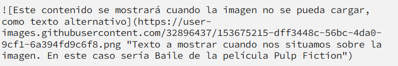

2.1 Este repositorio se debería considerar remoto, debido a que de momento no está en ningun lugar en local, tan solo en la nube.

2.2

2.3

2.4
Tipos de encabezado: el tipo de encabezado se digtamina por la cantidad de "hashtags" que pongas antes de un texto (de 1 a 6, cuantos mas hashtags, más pequeño).

Salto de linea: Si queremos que haya un salto de linea, hay que pulsar la tecla enter.

Tipos de comentario: un comentario como el siguiente, puede estar en la misma linea que un texto: 

En cambio, estos de aqui deben ir solos (menos el que tiene el mismo formato que el anterior, que es híbrido):

Si intentamos escribir un comentario que solo puede ir solo junto a más texto, se interpretará como más caracteres y no se escribirá (un ejemplo de lo que NO hay que hacer):

Para poner texto en negrita, dicho texto debe ir entre 4 asteriscos o 4 barras bajas (2 por la izquierda y 2 por la derecha).

Para poner texto en cursiva, dicho texto debe ir entre 2 asteriscos o 2 barras bajas (1 por la izquierda y 1 por la derecha).

Si se quiere poner en negrita y cursiva, deberá ir entre 6 asteriscos o 6 barras bajas (3 por la izquierda y 3 por la derecha).

Si se quiere añadir una cita, se debe poner un mayor que al principio de la línea.

Se pueden añadir varios niveles de cita con más mayores que al principio de la linea.

Se pueden hacer listas desordenadas poniendo al principio de la linea de cada item un asterisco, un mas o un menos.

Se puede hacer una lista ordenada poniendo el número que le pertoca a cada item.

Las listas pueden anidarse con tabuladores.

Para poner un enlace, dicho enlace debe ir entre menor que y mayor que

Otra alternativa:

No se puede subrayar en MarkDown!!!

Se puede tachar texto poniendolo entre 4 virgulillas (2 a la izquierda y 2 a la derecha)

Se pueden hacer líneas separadoras con 3 asteriscos, 3 menos o 3 barras bajas (separadas entre espacios o no, da igual).

Se pueden añadir imagenes:

La función de añadir imagen y añadir un link pueden combinarse.

Se pueden poner pedazos de codigo con 2 acentos abiertos:

Para añadir codigos de bloque, deben ir entre 2 lineas de 3 acentos abiertos o 3 virgulillas como en este ejemplo:

Si queremos escribir textualmente un carácter especial, debemos poner una barra antes (como en regex). Aqui los que deben llevar barra:

Se pueden hacer task lists:

Se pueden generar tablas:

Se pueden añadir mensajes de advertencia:
